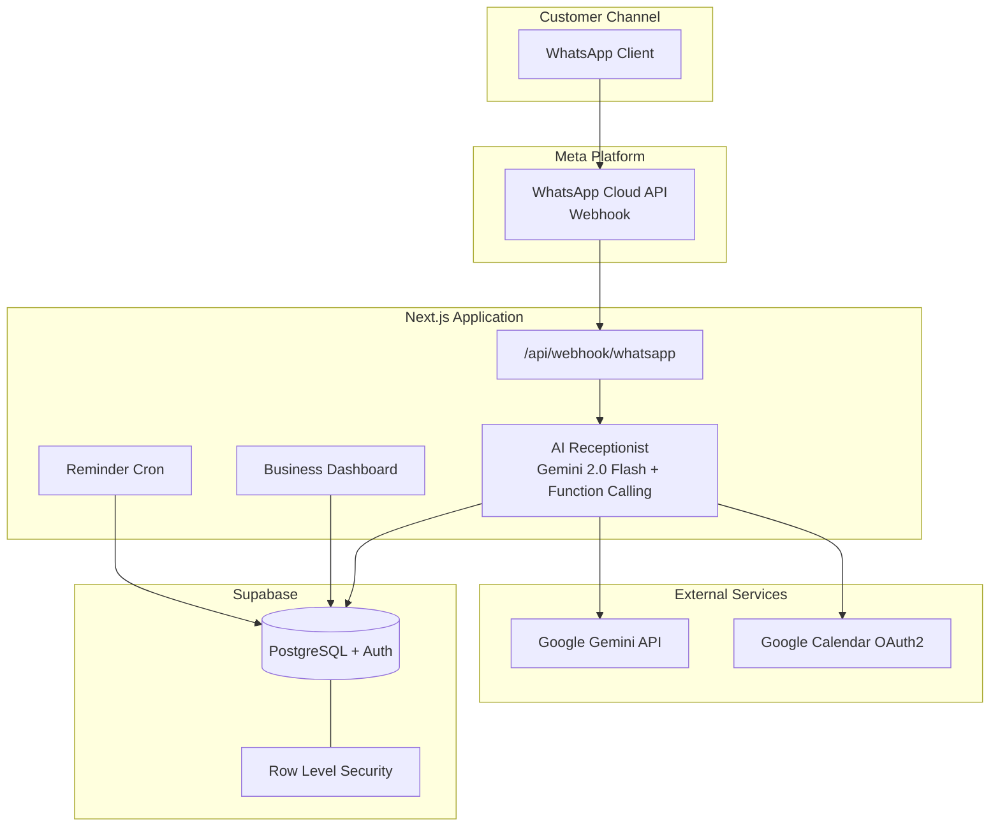

<div align="center">

# RandevuAI

**WhatsApp üzerinden çalışan AI resepsiyonist ve randevu asistanı — KOBİ'ler için**

[](https://nextjs.org/)
[](https://www.typescriptlang.org/)
[](https://supabase.com/)
[](https://ai.google.dev/)
[]()

[Demo](#) · [Kurulum](#-kurulum) · [Mimari](#-mimari) · [API](#-api-özeti) · [Yol Haritası](#-yol-haritası)

</div>

---

## Hackathon

**RandevuAI**, Türkiye'deki küçük ve orta ölçekli işletmelerin (kuaför, klinik, avukat, emlak ofisi vb.) WhatsApp üzerinden gelen müşteri mesajlarına **7/24 otomatik yanıt vermesini**, **Türkçe doğal dilde randevu almasını** ve **Google Takvim ile senkronize etmesini** sağlayan hafif bir SaaS MVP platformudur.

Projenin temel amacı yalnızca chatbot cevapları vermek değil; **uçtan uca randevu operasyonunu** — hizmet seçimi, boş slot hesaplama, müşteri onayı, takvim yazımı, hatırlatma ve iptal — tek bir panelden yönetilebilir hale getirmektir. Sistem, **Next.js App Router** üzerine kurulu modüler bir mimari kullanır; her katman (UI, API, entegrasyon, AI motoru) bağımsız geliştirilebilir ve test edilebilir şekilde ayrılmıştır.

WhatsApp Cloud API üzerinden gelen mesajlar webhook ile yakalanır, **Google Gemini** function calling ile işlenir, Supabase PostgreSQL'de kalıcı olarak saklanır ve işletme sahibi web panelinden izlenir. Randevular Google Calendar'a otomatik yazılır; çakışma kontrolü hem veritabanı hem takvim katmanında yapılır.

---

## Öne Çıkan Özellikler

| Özellik | Açıklama |
|---------|----------|
| **AI Resepsiyonist** | Google Gemini ile Türkçe, samimi, kısa WhatsApp diyalogları |
| **Function Calling** | Hizmet listeleme, slot sorgulama, randevu oluşturma, iptal |
| **WhatsApp Cloud API** | Meta webhook, imza doğrulama, otomatik yanıt |
| **Google Calendar** | OAuth2, event oluşturma/iptal, meşgul slot entegrasyonu |
| **İşletme Paneli** | Hizmetler, randevular, konuşmalar, ayarlar, WhatsApp kurulum |
| **Onboarding** | 6 adımlı kurulum sihirbazı |
| **Hatırlatma Cron** | Yarınki randevular için WhatsApp hatırlatması |
| **RLS Güvenlik** | Supabase Row Level Security — işletme verisi izolasyonu |

---

## Mimari



<details>
<summary>ASCII diagram (fallback)</summary>

```
┌─────────────────────────────────────────────────────────────────┐
│                        MÜŞTERİ (WhatsApp)                        │
└───────────────────────────────┬─────────────────────────────────┘
                                │ mesaj
                                ▼
┌─────────────────────────────────────────────────────────────────┐
│              Meta WhatsApp Cloud API (Webhook)                 │
│              POST /api/webhook/whatsapp                          │
└───────────────────────────────┬─────────────────────────────────┘
                                │
                                ▼
┌─────────────────────────────────────────────────────────────────┐
│                    lib/ai-receptionist.ts                      │
│         Google Gemini 2.0 Flash + Function Calling               │
│   list_services · get_slots · create_appointment · cancel        │
└───────┬─────────────────────────────────┬───────────────────────┘
        │                                 │
        ▼                                 ▼
┌───────────────────┐           ┌─────────────────────┐
│    Supabase       │           │  Google Calendar    │
│  PostgreSQL + Auth│           │  OAuth2 + Events    │
│  businesses       │           └─────────────────────┘
│  services         │
│  appointments     │
│  conversations    │
└─────────┬─────────┘
          │
          ▼
┌─────────────────────────────────────────────────────────────────┐
│              Next.js Dashboard (İşletme Sahibi)                  │
│   /dashboard · /settings · /services · /appointments             │
└─────────────────────────────────────────────────────────────────┘
```

</details>

### Katman Sorumlulukları

| Katman | Dizin | Sorumluluk |
|--------|-------|------------|
| **UI** | `app/`, `components/` | Landing, auth, dashboard, onboarding |
| **API** | `app/api/` | Webhook, OAuth, cron, health |
| **AI Motoru** | `lib/ai-receptionist.ts` | Gemini diyalog, tool execution |
| **Entegrasyonlar** | `lib/whatsapp.ts`, `lib/google-calendar.ts` | Dış servis iletişimi |
| **Veri** | `supabase/migrations/` | Şema, RLS, trigger |
| **Tipler** | `types/` | TypeScript domain modelleri |

---

## Tech Stack

| Bileşen | Teknoloji |
|---------|-----------|
| Framework | Next.js 16 (App Router) + TypeScript |
| UI | Tailwind CSS 4 + Radix UI |
| Veritabanı | Supabase (PostgreSQL) |
| Auth | Supabase Auth (email) |
| AI | Google Gemini API (`gemini-2.0-flash`) |
| Mesajlaşma | WhatsApp Cloud API v21 |
| Takvim | Google Calendar API + OAuth2 |
| Deploy | Vercel + Cron Jobs |
| Tarih/Saat | date-fns + date-fns-tz (Europe/Istanbul) |

---

## Proje Yapısı

```
randevuai/
├── app/
│   ├── api/
│   │   ├── appointments/      # Manuel randevu API
│   │   ├── auth/google/       # Calendar OAuth
│   │   ├── cron/reminders/    # Günlük hatırlatma
│   │   ├── health/            # Kurulum durumu
│   │   └── webhook/whatsapp/  # Meta webhook
│   ├── auth/                  # Giriş / kayıt
│   ├── dashboard/             # İşletme paneli
│   └── onboarding/            # Kurulum sihirbazı
├── components/
│   ├── ui/                    # Tasarım sistemi
│   ├── dashboard/             # Panel bileşenleri
│   └── onboarding/            # Wizard
├── lib/
│   ├── ai-receptionist.ts     # Gemini AI motoru
│   ├── google-calendar.ts     # Takvim entegrasyonu
│   ├── whatsapp.ts            # WhatsApp API
│   ├── actions/               # Server Actions
│   └── supabase/              # DB client
├── supabase/migrations/       # SQL şema
├── types/                     # Domain tipleri
└── scripts/check-env.mjs      # Env doğrulama
```

---

## Geliştirme Fazları

Proje 8 fazda MVP olarak tamamlanmıştır:

| Faz | Kapsam | Durum |
|-----|--------|-------|
| **0** | Proje iskeleti, Tailwind, UI | ✅ |
| **1** | Supabase şema, Auth, Dashboard iskelet | ✅ |
| **2** | Ayarlar, hizmetler, randevu paneli | ✅ |
| **3** | Google Calendar OAuth + slot hesaplama | ✅ |
| **4** | WhatsApp webhook altyapısı | ✅ |
| **5** | AI konuşma motoru (Gemini) | ✅ |
| **6** | Dashboard istatistikler, konuşma geçmişi | ✅ |
| **7** | Landing page, onboarding, fiyatlandırma | ✅ |
| **8** | Production hazırlığı, health, cron | ✅ |

---

## Kurulum

Detaylı rehber: **[docs/KURULUM.md](docs/KURULUM.md)**

### Gereksinimler

- Node.js 20+
- npm
- Supabase hesabı (ücretsiz)
- Google AI Studio API key (ücretsiz tier)
- Meta Developer hesabı (WhatsApp)
- Google Cloud Console (Calendar OAuth)

### Hızlı başlangıç

```bash
git clone https://github.com/mertturkel234/randevuai.git
cd randevuai
npm install
cp .env.example .env.local
# .env.local dosyasını doldurun
npm run check:env
npm run dev
```

Uygulama: [http://localhost:3000](http://localhost:3000)  
Kurulum kontrolü: [http://localhost:3000/api/health](http://localhost:3000/api/health)

### Environment değişkenleri

| Değişken | Zorunlu | Açıklama |
|----------|---------|----------|
| `NEXT_PUBLIC_APP_URL` | ✅ | Uygulama URL'i |
| `NEXT_PUBLIC_SUPABASE_URL` | ✅ | Supabase proje URL |
| `NEXT_PUBLIC_SUPABASE_ANON_KEY` | ✅ | Supabase anon key |
| `SUPABASE_SERVICE_ROLE_KEY` | ✅ | Service role (webhook için) |
| `GEMINI_API_KEY` | ✅ | [AI Studio](https://aistudio.google.com/apikey) |
| `GEMINI_MODEL` | ⬜ | Varsayılan: `gemini-2.0-flash` |
| `WHATSAPP_TOKEN` | ⬜ | Meta access token |
| `WHATSAPP_PHONE_NUMBER_ID` | ⬜ | Phone number ID |
| `WHATSAPP_VERIFY_TOKEN` | ⬜ | Webhook verify token |
| `WHATSAPP_APP_SECRET` | ⬜ | İmza doğrulama |
| `GOOGLE_CLIENT_ID` | ⬜ | Calendar OAuth |
| `GOOGLE_CLIENT_SECRET` | ⬜ | Calendar OAuth |
| `CRON_SECRET` | ⬜ | Vercel cron auth |

### Supabase migration

SQL Editor'de çalıştırın:

```
supabase/migrations/001_initial_schema.sql
```

---

## API Özeti

| Endpoint | Method | Açıklama |
|----------|--------|----------|
| `/api/webhook/whatsapp` | GET | Meta webhook verify |
| `/api/webhook/whatsapp` | POST | Gelen mesajları işle |
| `/api/appointments` | POST | Manuel randevu oluştur |
| `/api/auth/google` | GET | Calendar OAuth başlat |
| `/api/auth/google/callback` | GET | OAuth callback |
| `/api/cron/reminders` | GET | Randevu hatırlatma (cron) |
| `/api/health` | GET | Env kurulum durumu |

---

## AI Konuşma Akışı

```
Müşteri: "Merhaba randevu almak istiyorum"
    ↓
Gemini: Selamlama + hizmet listesi (list_services)
    ↓
Müşteri: "Saç kesimi"
    ↓
Gemini: Tarih sorar → get_available_slots
    ↓
Müşteri: "Yarın 14:00"
    ↓
Gemini: İsim sorar → onay ister
    ↓
Müşteri: "Evet, adım Ahmet"
    ↓
Gemini: create_appointment → DB + Google Calendar
    ↓
WhatsApp: "Randevunuz onaylandı ✅"
```

---

## Güvenlik

Detaylı güvenlik mimarisi için bkz. [SECURITY.md](./SECURITY.md).

- **Supabase RLS**: Her işletme yalnızca kendi verisini görür
- **Webhook imza**: `x-hub-signature-256` doğrulama (Meta)
- **Rate limiting**: İşletme başına günlük mesaj limiti (trial: 50)
- **Cron auth**: `CRON_SECRET` Bearer token
- **Env izolasyonu**: `.env.local` git'e dahil edilmez
- **AI güvenliği**: Function calling yalnızca sunucu tarafında çalışır

---

## Deploy (Vercel)

```bash
npm i -g vercel
vercel login
vercel
```

Tüm env değişkenlerini Vercel dashboard'a ekleyin. `vercel.json` günlük saat 18:00 hatırlatma cron'unu içerir.

Production sonrası güncelleyin:
- Meta webhook URL → `https://your-app.vercel.app/api/webhook/whatsapp`
- Google OAuth redirect → production callback URL
- Supabase Site URL → production URL

---

## Test Checklist

- [ ] `npm run check:env` → tüm zorunlu değişkenler dolu
- [ ] `npm run build` → hatasız derleme
- [ ] Kayıt / giriş çalışıyor
- [ ] Onboarding tamamlanıyor
- [ ] Hizmet ekleme / düzenleme
- [ ] Google Takvim bağlantısı
- [ ] WhatsApp webhook verify
- [ ] AI Türkçe yanıt veriyor
- [ ] Randevu DB + Calendar'a yazılıyor
- [ ] İptal akışı çalışıyor
- [ ] Hatırlatma cron (production)

---

## Yol Haritası

| Öncelik | Özellik |
|---------|---------|
| 🔜 | Stripe / iyzico ödeme entegrasyonu |
| 🔜 | Çoklu personel / çoklu takvim |
| 🔜 | SMS yedek kanal |
| 🔜 | Raporlama ve analitik |
| 🔜 | Instagram DM entegrasyonu |
| 🔜 | E2E test suite (Playwright) |

---

## Fiyatlandırma (Planlanan)

| Plan | Fiyat | Özellikler |
|------|-------|------------|
| **Deneme** | 14 gün ücretsiz | 50 mesaj/gün |
| **Başlangıç** | 499 TL/ay | Sınırsız mesaj, 1 hat |
| **Pro** | 999 TL/ay | Raporlar, öncelikli destek |

---

## Katkı

Bu proje aktif geliştirme aşamasındadır. [CONTRIBUTING.md](./CONTRIBUTING.md) dosyasına bakın. Conventional Commits ve feature-branch PR süreci uygulanır.

---

## Lisans

Private — Ticari kullanım. Tüm hakları saklıdır.

---

<div align="center">

**RandevuAI** — *Müşterileriniz yazar, AI randevu alır.*

Made with ❤️ in Turkey

</div>
